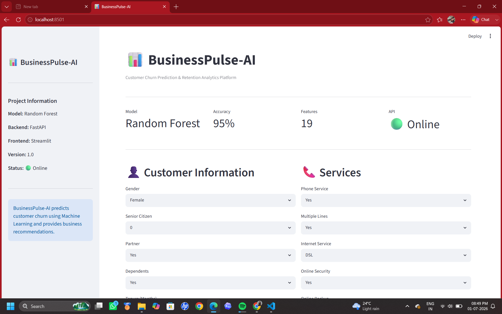
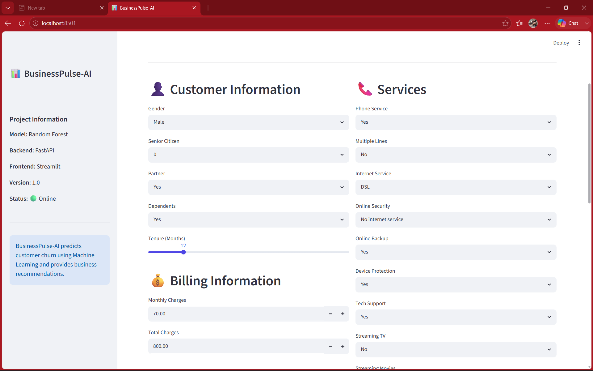
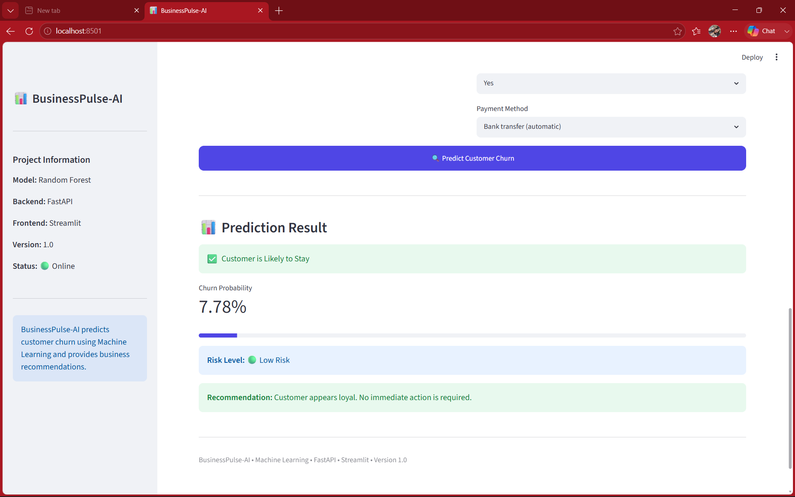
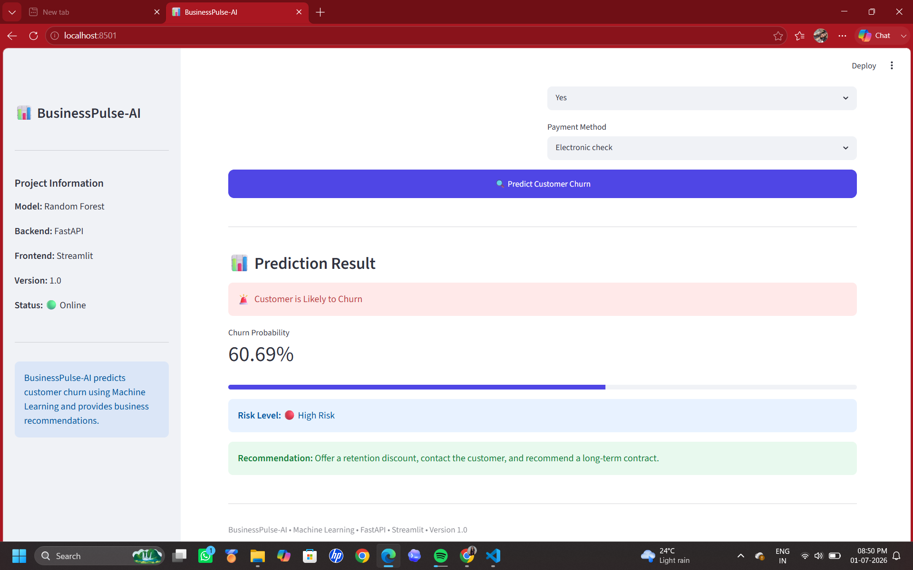
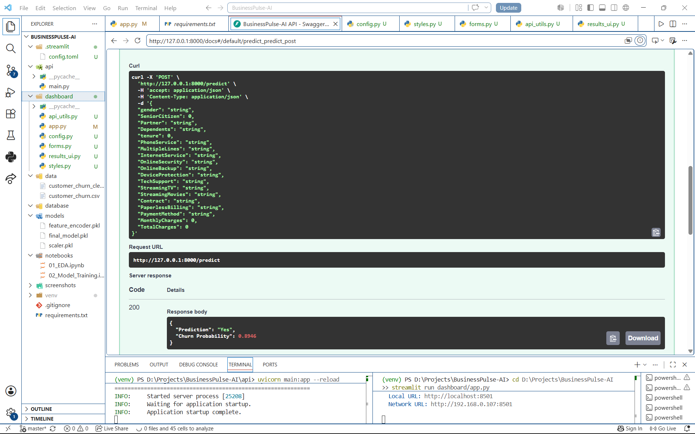

# 📊 BusinessPulse-AI

> Customer Churn Prediction & Retention Analytics Platform using Machine Learning, FastAPI and Streamlit.

---

## 🚀 Project Overview

BusinessPulse-AI is an end-to-end Machine Learning application that predicts whether a customer is likely to churn based on customer demographics, subscribed services, billing information, and contract details.

The application provides an interactive Streamlit dashboard, a FastAPI backend for model inference, and intelligent business recommendations based on prediction probability.

---

# ✨ Features

- 📊 Customer Churn Prediction
- 🤖 Machine Learning Model (Random Forest)
- ⚡ FastAPI REST API
- 🎨 Interactive Streamlit Dashboard
- 📈 Churn Probability Visualization
- 🚦 Risk Level Detection
- 💡 Business Recommendations
- 📁 Prediction History Storage
- 📦 Modular Project Structure
- 🧩 Responsive UI

---

# 🛠 Tech Stack

| Technology | Usage |
|------------|----------------|
| Python | Programming Language |
| Pandas | Data Processing |
| NumPy | Numerical Computing |
| Scikit-Learn | Machine Learning |
| Random Forest | Prediction Model |
| FastAPI | Backend API |
| Streamlit | Frontend Dashboard |
| Joblib | Model Serialization |

---

# 📂 Project Structure

```text
BusinessPulse-AI
│
├── api/
│   └── main.py
│
├── dashboard/
│   ├── app.py
│   ├── api_utils.py
│   ├── config.py
│   ├── forms.py
│   ├── results_ui.py
│   └── styles.py
│
├── data/
│   ├── customer_churn.csv
│   └── customer_churn_clean.csv
│
├── database/
│   └── prediction_history.csv
│
├── models/
│   ├── final_model.pkl
│   ├── scaler.pkl
│   └── feature_encoder.pkl
│
├── notebooks/
│   ├── 01_EDA.ipynb
│   └── 02_Model_Training.ipynb
│
├── screenshots/
│
├── requirements.txt
├── README.md
└── .gitignore
```

---

# 📸 Project Screenshots

## Dashboard



---

## Customer Input Form



---

## Low Risk Prediction



---

## High Risk Prediction



---

## FastAPI Swagger Documentation



---

# ⚙️ Installation

## Clone Repository

```bash
git clone https://github.com/yourusername/BusinessPulse-AI.git
```

```bash
cd BusinessPulse-AI
```

---

## Install Dependencies

```bash
pip install -r requirements.txt
```

---

## Start FastAPI

```bash
cd api
uvicorn main:app --reload
```

API runs at:

```
http://127.0.0.1:8000
```

Swagger Documentation:

```
http://127.0.0.1:8000/docs
```

---

## Start Streamlit

Open another terminal

```bash
streamlit run dashboard/app.py
```

Dashboard:

```
http://localhost:8501
```

---

# 📊 Machine Learning Pipeline

- Data Collection
- Data Cleaning
- Exploratory Data Analysis
- Feature Engineering
- Data Encoding
- Feature Scaling
- Model Training
- Model Evaluation
- Model Serialization
- FastAPI Deployment
- Streamlit Integration

---

# 📈 Model Information

| Model | Accuracy |
|---------|----------|
| Random Forest Classifier | **95%** |

Input Features: **19**

Output:

- Customer Churn Prediction
- Churn Probability
- Risk Level
- Business Recommendation

---

# 📡 API Endpoint

## POST `/predict`

Example Response

```json
{
  "Prediction": "Yes",
  "Churn Probability": 0.8946
}
```

---

# 💡 Business Recommendations

BusinessPulse-AI automatically suggests actions based on churn probability.

### High Risk

- Offer retention discounts
- Contact customer
- Recommend long-term contract

### Low Risk

- Customer appears loyal
- No immediate action required

---

# 📌 Future Improvements

- User Authentication
- Cloud Deployment (AWS/Azure)
- Database Integration (MySQL/PostgreSQL)
- Prediction Dashboard Analytics
- Email Notifications
- Customer Segmentation
- Explainable AI (SHAP)

---

# 👤 Developer

Machine Learning & Data Science Enthusiast

Focused on building end-to-end AI applications using Machine Learning, FastAPI, Streamlit, and Python.

---

# ⭐ If you like this project

Give this repository a ⭐ on GitHub!